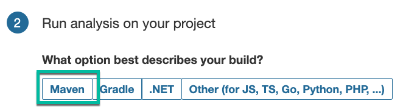
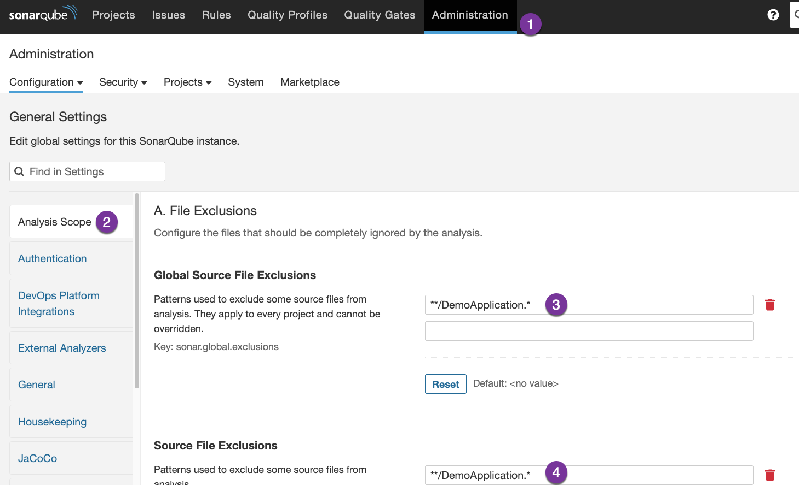
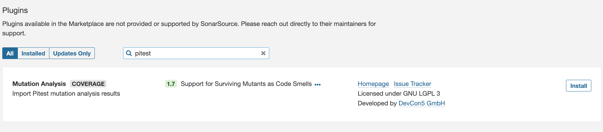
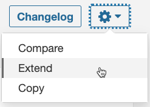
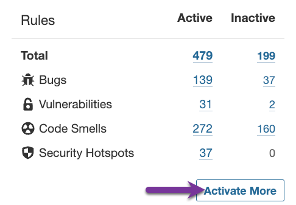
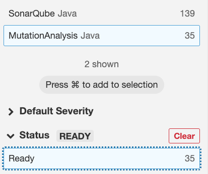
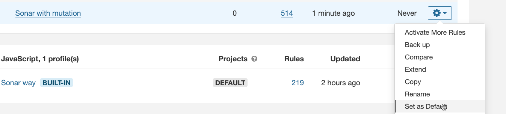

# Getting Started

Start Sonarqube executing in a terminal:

```shell
docker-compose up -d
```

## Sonarqube Project Configuration

Open in a browser the address [http://localhost:9001/](http://localhost:9001/).

Login with `admin` user and `admin` pasword.

The first time we start, we've not projects, so a screen title "How do you want to create your project" is shown.

Select card **Manually**.

Enter a project display name, a project key, and select **main** branch name.

At screen *How do you want to analyze your repository* select **Locally**.

Press the button **Generate** to generate a project token. Take note of the token and press **Continue**.
At step 2, select **Maven**.



Press **Copy** to copy the mvn command shown. e.g:

```
mvn clean verify sonar:sonar \
  -Dsonar.projectKey=Mutation-testing-demo \
  -Dsonar.host.url=http://localhost:9001 \
  -Dsonar.login=sqp_187c866b279f2dcdb0ac2ceada83e6bb8222a384
```

### Add exclusions

Go to menu **Administration** and select **Analysis Scope** at the left menu.

Add to source file exclusions: `**/DemoApplication.*` to exclude Spring Boot Application.



NOTE: Jacoco already sets the exclusion, and it works by command line, but it's ignored by SonarQube.


### Add piTest Sonarqube plugin

Go to **Administration > Marketplace**. Press button **I understand the risk**.

Search `pitest`. After the plugin is shown, press **Install** button.



Click **Restart Server** to install the plugins.

Go to **Quality Profiles** in SonarQube. There are two profiles available in the Java section. 
One profile Sonar Way, which is the default profile and one profile *Mutation Analysis*. 

Click the **Sonar way** profile and open **Settings** menu. Choose **Extend**.



Give a name like `Sonar with mutation` and press *Extend*.

At left card press **Activate More**.



Click the **MutationAnalysis** repository and the **Ready** status.



We'll see all rules related with mutators. Press top button **Bulk Change** and activate in the profile we've created (e.g: **Sonar with mutation**).

More or less 35 rules are activated.

Navigate again to Quality Profiles, go to the Java section and set the created profile as default.




At the pittest maven configuration section of `pom.xml` add a configuration so the output format is `xml` (so Sonarqube can understand the results):

```xml
<plugin>
    ...
    <groupId>org.pitest</groupId>
    <artifactId>pitest-maven</artifactId>
    <configuration>
        <outputFormats>
            <outputFormat>xml</outputFormat>
        </outputFormats>
    </configuration>
</plugin>
```


## Usage

### Command line

Using command line we can execute and see reports:

```shell
mvn clean install
```

Open in a browser the file `target/site/jacoco/index.html` to see the Jacoco Coverage Report.
Open in a browser the file `target/pit-reports/index.html` to see PiTest report.


### SonarQube

Execute the command generated in SonarQube project creation.

e.g:

```
mvn clean verify sonar:sonar \
  -Dsonar.projectKey=Mutation-testing-demo \
  -Dsonar.host.url=http://localhost:9001 \
  -Dsonar.login=sqp_187c866b279f2dcdb0ac2ceada83e6bb8222a384
```

Go to tab **Measures** and select left menu option **Mutation Analysis**.


## Reference Documentation

For further reference, please consider:

* [Pitest](https://pitest.org/)
* [Sonarqube Docker compose Article](https://medium.com/@denis.verkhovsky/sonarqube-with-docker-compose-complete-tutorial-2aaa8d0771d4)


Sonar token: sqp_b7c45eb17cdfe71a5a1a92beb96abf4f56f6d52a

mvn clean verify sonar:sonar \
-Dsonar.projectKey=Mutation-testing-demo \
-Dsonar.host.url=http://localhost:9001 \
-Dsonar.login=sqp_72e2b0e49200dbe2163674bf66aae85e33d5458a


